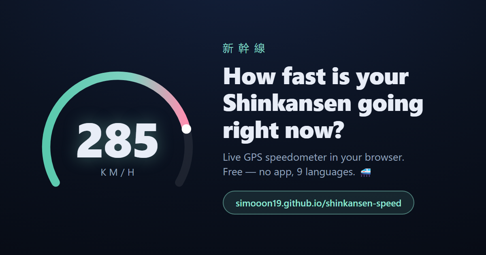

# 新幹線 Shinkansen Speed 🚄

**Live GPS speedometer in your browser — see how fast your bullet train is really going.**

### ▶ [simooon19.github.io/shinkansen-speed](https://simooon19.github.io/shinkansen-speed/)

Open the link on your phone, tap **Start**, allow location access, and watch the needle climb toward 300 km/h. No app, no install, no tracking — everything runs locally in your browser.

## Features

- **Live speed** from your phone's GPS (Doppler speed when available, position-delta fallback)
- **Max / average speed, distance travelled** and GPS accuracy
- **Speed history chart** (last 5 minutes)
- **Auto-scaling gauge** — starts at 150 km/h and grows to 350/600/1000 as you speed up; manual override available
- **9 languages**, auto-detected from your phone: English, 日本語, Svenska, 简体中文, 繁體中文, 한국어, Deutsch, Français, Español
- **mph / m/s / Mach** readout
- **Milestone confetti** at 200, 285, 320 and 500 km/h 🎉
- **Tunnel detection** — GPS dropouts at speed are flagged as tunnels (you'll see plenty on the Tōkaidō line)
- **Screen wake lock** so the display stays on
- **Installable on iPhone & Android** (PWA) — add it to your home screen, works offline
- **Share button** that includes your current speed
- **Global leaderboard** 🏆 — submit your top speed and compete today / this week / this month / all-time, with a 30-day trend chart. Submissions are validated server-side against train physics (acceleration limits, GPS accuracy, trace continuity) to keep fake entries out. Only a display name, speed and timestamp are stored — plus an optional **line label** (e.g. Tōkaidō) that is detected on-device from your trace; your position never leaves your phone. A salted IP hash is kept for rate limiting only.
- Works for any train, plane or ferry — not just the Shinkansen (passengers only — never use while driving)

*Unofficial fan-made project — not affiliated with JR or any railway company.*

## Tips

- GPS works best **near a window**
- Speed drops out in tunnels — the value freezes until the signal returns
- Tōkaidō Shinkansen (Nozomi) cruises at ~285 km/h; Tōhoku (Hayabusa) reaches 320 km/h

## Tech

A single self-contained `index.html` — no frameworks, no build step. Everything runs locally in your browser; the only network calls are the optional leaderboard fetch/submit (Supabase). Uses the Geolocation API, Screen Wake Lock API, Web Share API, SVG and canvas. Hosted on GitHub Pages.

- [`poster.html`](poster.html) — printable A4 QR poster
- [`og.html`](og.html) — social preview image template

## License

MIT — see [LICENSE](LICENSE).
